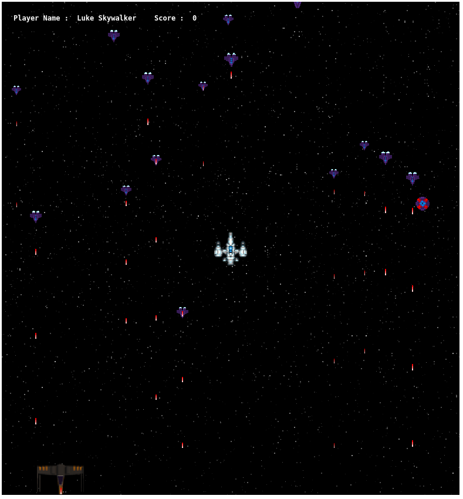
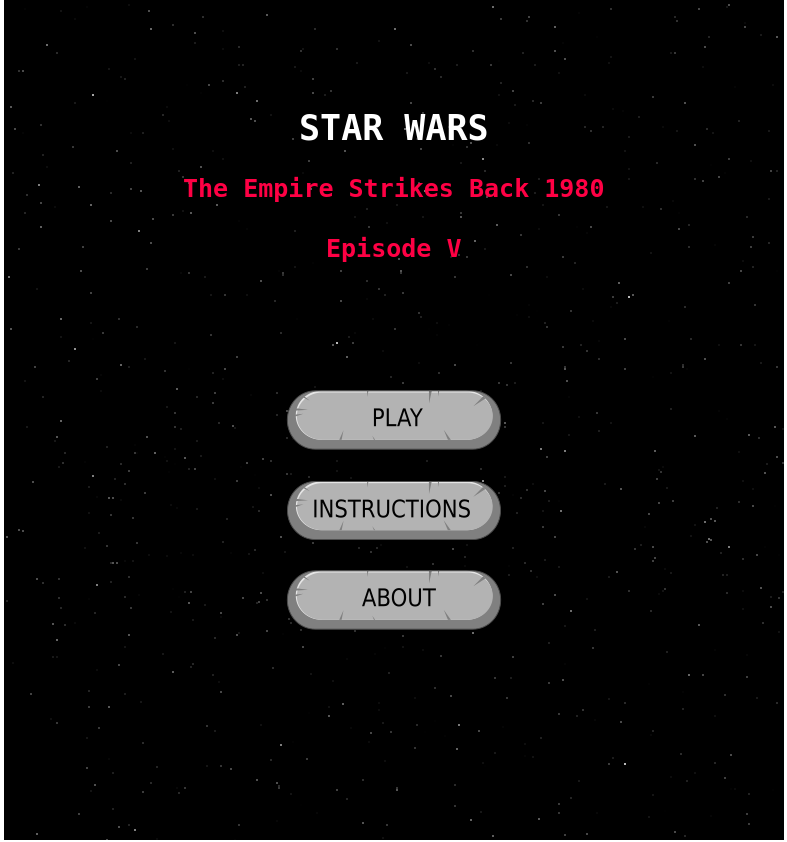
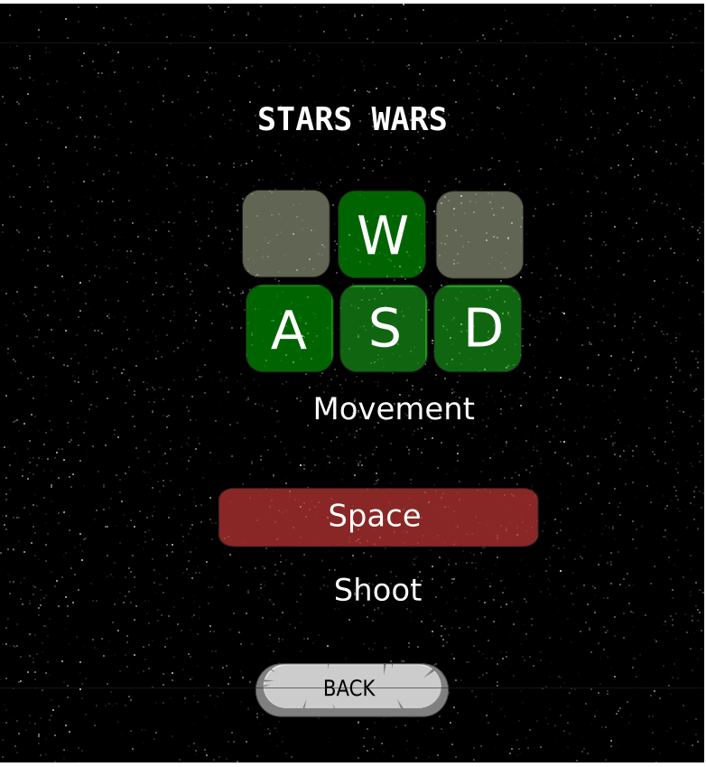
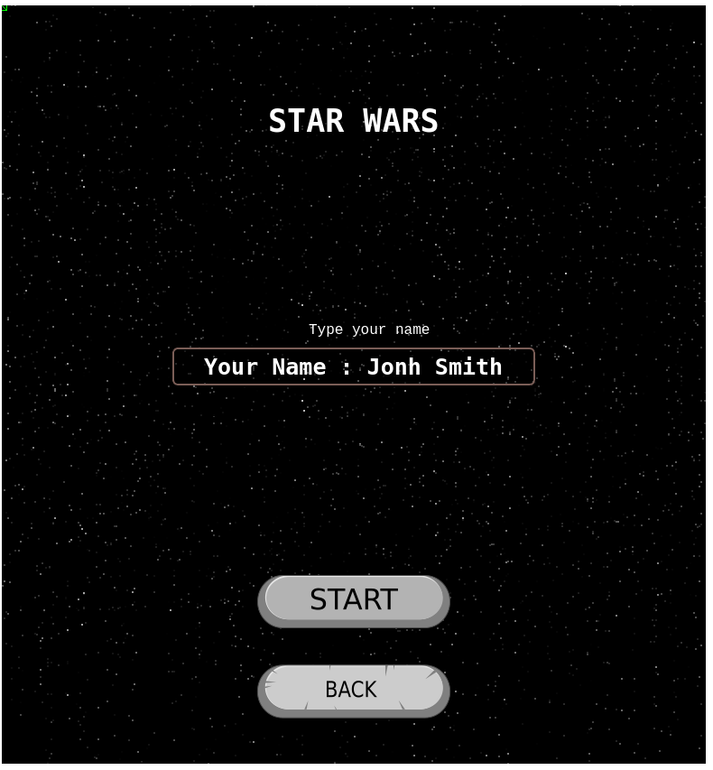
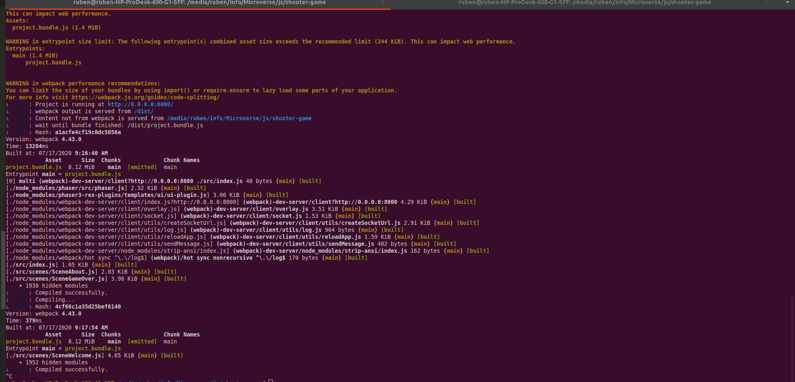

# Javascript Shooter Game

This project consist on building a video game using JavaScript and the game engine [Phaser](https://phaser.io/). It is required for this project using the best practices for programming javascript applications, use test tools like jest, modules, class, webpack, phaser 3.




## Built With

- HTML
- Javascript
- Webpack
- Webpack modules
- Phaser 3
- Jest
- Babel  

## Live Demo

[Live Demo Link](https://phasershootergamejs.herokuapp.com/)


## Getting Started

**Want to check the code and make some changes please .**

Do you want to clone this project please use this command on you terminal

```
git@github.com:rubenpazch/shooter-game.git
```
or

```
https://github.com/rubenpazch/shooter-game.git
```


webpack is used to compile JavaScript modules. Once installed, you can interface with webpack either from its CLI or API. If you're still new to webpack, please read through the core concepts and this comparison to learn why you might use it over the other tools that are out in the community.

Core concepts : [Webpack](https://webpack.js.org/concepts/)

## Play the game

- Welcome scene where everything start




- Allowed movements on the game



- Add your name for the game and then press start





## How was designed the game

This game was designed thinking on the famous movie star wars, the main idea is about having a shooter and some enemies, we customize some existing 

* Genres
  - FPS: First-person shooters: this game build thinking in one person to be the shooter and increse his score if he is able to shoot all ship enemies.
  - Score system: As soon as the player is dead the game will calculate all scores and get the higher and save it for future references.
* In-Game Terms
  - Game Over: The player should shoot the ship enemies and as soon as the player is shooted by the enemies the game is over and he have a final score, the game can be restarted.
* Game Mechanics vs Gameplay
  - Movement: this game is based on the use of the keyboard to move around the board and shoot the enemies using space.
  - Shoot: for shooting the enemies the player have to press space.
  - Restart: the player can restart the game again after he is dead.
  - Enemies: they are 3 types of enemies 
    - Static enemies
    - shooter enemies
    - shooter enemies with fast movement
  -Score system: every time the player is killed, the game calculate every result and shows on the game over view wich was the higher score.


## Prerequisites

- Webpack 
- NPM 

## Setup

Install NPM

Check that you have node and npm installed

To check if you have Node.js installed, run this command in your terminal:


```
node -v
```

To confirm that you have npm installed you can run this command in your terminal:


```
npm -v
```


## Install

install npm and webpack


```
sudo apt update
sudo apt install npm
```


:Show
Local Installation Webpack

To install the latest release or a specific version, run one of the following commands:

```
npm install --save-dev webpack
npm install --save-dev webpack-cli
```

Global Installation Webpack

The following NPM installation will make webpack available globally:

```
npm install --global webpack
```
Now you can make changes on src files to change the behavior of the application

finally if you want to compile the code run this command

```
npm run start
```

After running the above command you will see in your console like a log of activity if everything is ok you will see something like this:




if you have this in your screen that minds everything is working correctly now you can go to the browser with the next link:

```
http://localhost:8000/
```

## Run test on local

```
npm run test
```


## Authors


👤 **Ruben Paz Chuspe**

- Github: [@rubenpazch](https://github.com/rubenpazch)
- Linkedin: [rubenpch](https://www.linkedin.com/in/rubenpch/)
- Twitter: [chuspepaz](https://twitter.com/ChuspePaz)


## 🤝 Contributing

Contributions, issues and feature requests are welcome!

Feel free to check the [issues page](issues/).

## Show your support

Give a ⭐️ if you like this project!

## Acknowledgments

- We thank microverse inc. for this learning opportunity.
