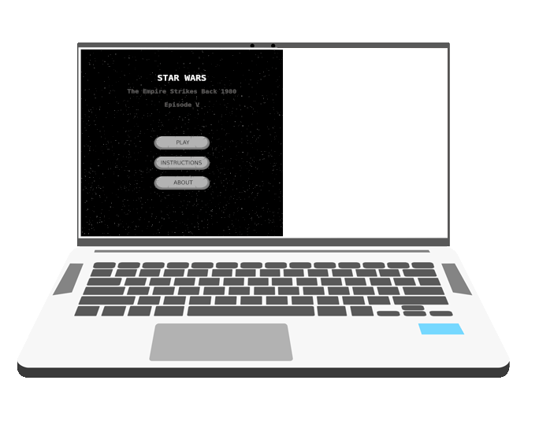

<p align="center">
    
</p>

<p align="center">
    <h1 align="center"> Shooter Game  </h1>    
</p>

<p align="center">
    <h2 align="center"> Web application using phaser to create a game</h2>    
</p>

<p align="center">
    <a href="https://img.shields.io/badge/Microverse-blueviolet" alt="Contributors">
        </a>
    <a href="https://www.w3schools.com/js/js_es6.asp" alt="JavaScript">
        </a>
    <a href="https://webpack.js.org/" alt="Webpack">
        </a>
    <a href="http://phaser.io/" alt="Phaser">
        </a>
    <a href="https://jestjs.io/docs/en/getting-started" alt="Jest">
        </a>  
    <a href="https://www.heroku.com/" alt="Heroku">
        </a>
</p>


  <p align="center">    
    <br />
    <a href="https://github.com/othneildrew/Best-README-Template"><strong>Explore this project »</strong></a>
    <br />
    <br />&#10023;
    <a href="https://morning-taiga-75196.herokuapp.com/">View Demo</a>   &#10023;  
    <a href="https://github.com/rubenpazch/Group-our-transactions/issues">Report Bug</a>    &#10023;
    <a href="#Getting-Started">Getting Started</a> &#10023; <a href="#Install">Installing</a> &#10023;
    <a href="#Getting-Started">Getting Started</a> &#10023; <a href="#Extra-Feature">Extra Feature</a> &#10023;
    <a href="#Screenshots-of-the-App">Screenshots of the App</a> &#10023;
    <a href="#Authors">Author</a> &#10023;
    
  </p>


<br/>

# Javascript Shooter Game

Shooter game is a project built using JavaScript and the game engine [Phaser](https://phaser.io/). In order to learn how to build games with Phaser 3 and  Webpack 4 the last version I did follow some tutorials and customize a previous example for building this amazing web application, the goal of this game is to kill different enemies shooting them and after finishing the two stages get a final score compared with other players.


## Built With

- HTML
- Javascript
- Webpack 4
- Webpack modules
- Phaser 3
- Jest
- Babel  

## Live Demo

[Live Demo Link](https://phasershootergamejs.herokuapp.com/)


## Getting Started

**Want to check the code and make some changes please .**

Do you want to clone this project please use this command on you terminal

```
git@github.com:rubenpazch/shooter-game.git
```
or

```
https://github.com/rubenpazch/shooter-game.git
```


Webpack is used to compile JavaScript modules. Once installed, you can interface with Webpack either from its CLI or API. If you're still new to Webpack, please read through the core concepts and this comparison to learn why you might use it over the other tools that are out in the community.


Core concepts : [Webpack](https://webpack.js.org/concepts/)

## Instructions to play the game   :video_game:

We have two stages on this game, every stage increase the speed of how fast enemies appear.

### 1st. Welcome Scene

- The welcome scene where everything starts, this is the first windows you will see on the game before you start playing on the game.


### 2nd. Add your information

- In the second scene we have the option to add our name to the game and this information will be saved on the applications to track your score.


### 3rd. Playing scene

- This is the third and the main scene where we have all the logic for the game, we have our ship and some enemies ship, meteors and others, we can shoot the enemies pressing space. 


## How was designed the game

This game was designed thinking on the famous movie star wars, specifically on the movie released on the year 1980 "The Empire Strikes Back", the main idea is about having a shooter and some enemies.

## The Planification  :anger:

This game was developed in 5 stages: 

### 1 stage 

In the first stage, we work on the learning process to user Phaser and how to integrate this framework with Webpack.

###  2 stage

During this stage, I spend some time working on searching some free elements and assets needed to customize the game, then I spend some time building the tutorial related with this game and understanding most of the features.


>  My goal for this day was to have done most of the tutorial and start making changes, it was hard to understand some details about the code used on the example after I had a better idea about the code I start to customize some assets according to my story.

###  3 stage

At this stage I spent some time building the scenes for the welcome and the scene for entering the name information of the player.

###  4 stage

This was a very particular day where I spent time trying to refactor some code and work on customization of the game functionality.

###  5 stage

On the last stage I spend time doing more refactoring of the code and in parallel, I work on test cases, finally I did the readme file.


### Genres    :anger:
  
  FPS: First-person shooters: this game build thinking in one person to be the shooter and increse his score if he is able to kill all ship enemies. 

  With that said, this is a game for one player, the only player has to move around the board and shoot as much as possible enemies, this game is supposed to have different stages, every stage will have different difficulties related with the speed of how enemies appear, how fast they move around in the board vertically, finally we have some enemies with the ability to follow the player.
  
### In-Game Terms :anger:

Difficulty: This game starts from easy and increases the difficulty on every stage, each stage increase the velocity of vertical movement and how fast these elements appear on the board.


Game Over: The player should shoot the ship enemies and as soon as the player is shooted by the enemies the game is over and he has a final score, the game can be started again at this point.

Hit Points: Every time the player shoot and enemies it counts as a point and the score increase, the final score is compared with other players to get a higher score.


Map/level: Each stage represent a different level on the game, the map does not change when the different stage is open.


### Game Mechanics  :anger:

Movement: 

This game is based on the use of the keyboard to move around the board and shoot 
The enemies using space, the player can move the ship using these keys.

- W : To move up
- S : To move down
- A : To move right 
- D : To move left

Shoot: 

For shooting the enemies the player has to press space.

Restart: 

The player can restart the game again after he is dead, this means the player was shooted or hit for an enemy.

Enemies: 

they are 3 types of enemies 
* Static enemies (Meteors) 
* shooter enemies 
* shooter enemies with the fast movement
* Enemies that follow the player until they get hit the player

### Gameplay :anger:
 
This game is based on stages, the player starts on the first stage, in this point, the speed of enemies are slow, on the second stage the speed increase and enemies appear faster, every enemy has the possibility to hit the player and some of them are able to shoot, the game finish when the player is shooted or hit.


### Score System :anger:

Every time the player is killed, the game calculates every result and shows on the game overview which results was a higher score.


## Technical details  for the scoring system

For saving and calculating the higher score we use an API to save every result of the game when the player types his name on the game this information is saved using the API, and as soon the game is over this score is saved and then we get all result to compare the higher score.


## Setup

### Prerequisites

- Webpack 
- NPM 


Install NPM

Check that you have node and npm installed

To check if you have Node.js installed, run this command in your terminal:


```
node -v
```

To confirm that you have npm installed you can run this command in your terminal:


```
npm -v
```


## Install

install npm and webpack


```
sudo apt update
sudo apt install npm
```


:Show
Local Installation Webpack

To install the latest release or a specific version, run one of the following commands:

```
npm install --save-dev webpack
npm install --save-dev webpack-cli
```

Global Installation Webpack

The following NPM installation will make webpack available globally:

```
npm install --global webpack
```
Now you can make changes on src files to change the behavior of the application

finally, if you want to compile the code run this command

```
npm run start
```

After running the above command you will see in your console like a log of activity if everything is ok you will see something like this:


if you have this in your screen that minds everything is working correctly now you can go to the browser with the next link:

```
http://localhost:8000/
```

## Run test on local

```
npm run test
```


## Authors


👤 **Ruben Paz Chuspe**

- Github: [@rubenpazch](https://github.com/rubenpazch)
- Linkedin: [rubenpch](https://www.linkedin.com/in/rubenpch/)
- Twitter: [chuspepaz](https://twitter.com/ChuspePaz)


## 🤝 Contributing

Contributions, issues and feature requests are welcome!

Feel free to check the [issues page](issues/).

## Show your support

Give a ⭐️ if you like this project!

## Acknowledgments

- We thank microverse inc. for this learning opportunity.
- Build a Space Shooter with Phaser 3 [tutorial](https://learn.yorkcs.com/category/tutorials/gamedev/phaser-3/build-a-space-shooter-with-phaser-3/)
- Beginner’s Guide to Game Mechanics [design a game](https://www.gamedesigning.org/learn/basic-game-mechanics/)
- Creating a Phaser 3 Template – Part 1 [design a game](https://phasertutorials.com/creating-a-phaser-3-template-part-1/)
